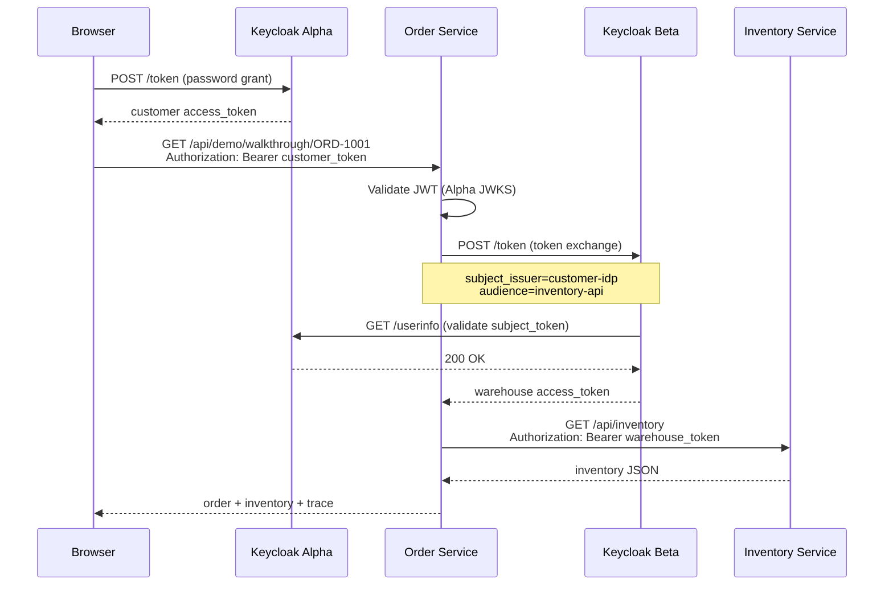

# Token exchange

This demo implements **cross-IdP token exchange** as defined in [RFC 8693](https://datatracker.ietf.org/doc/html/rfc8693), using Keycloak's legacy token exchange (v1) with Fine-Grained Admin Permissions v1.

## Problem being solved

Alice has a token from **Keycloak Alpha** (`iss: http://localhost:8180/realms/customer`). The **Inventory Service** only accepts tokens from **Keycloak Beta** (`iss: http://localhost:8181/realms/warehouse`).

The Order Service cannot:

- Forward Alice's token directly (wrong issuer/audience)
- Use a static service account (loses user identity and violates least privilege)

Instead it **exchanges** Alice's token for a new token scoped to `inventory-api` at Beta.

## Exchange request

The Order Service posts to Keycloak Beta's token endpoint:

```http
POST /realms/warehouse/protocol/openid-connect/token
Content-Type: application/x-www-form-urlencoded

grant_type=urn:ietf:params:oauth:grant-type:token-exchange
&client_id=order-service-broker
&client_secret=order-service-broker-secret
&subject_token=<alice-access-token-from-alpha>
&subject_token_type=urn:ietf:params:oauth:token-type:access_token
&subject_issuer=customer-idp
&requested_token_type=urn:ietf:params:oauth:token-type:access_token
&audience=inventory-api
```

### Parameter reference

| Parameter | Value | Meaning |
|-----------|-------|---------|
| `grant_type` | `urn:ietf:params:oauth:grant-type:token-exchange` | RFC 8693 token exchange |
| `subject_token` | Alpha access token | Token to exchange |
| `subject_token_type` | `access_token` | Type of subject token |
| `subject_issuer` | `customer-idp` | Beta IdP alias for Alpha |
| `audience` | `inventory-api` | Target client for issued token |
| `client_id` / `client_secret` | broker credentials | Authenticates the exchange client |

## How Beta validates the Alpha token

1. Beta reads `subject_issuer=customer-idp`
2. Looks up the OIDC Identity Provider configuration (`customer-idp`)
3. Validates the Alpha access token via Alpha's **userinfo** endpoint
4. Imports/links the user into `warehouse` realm if needed
5. Mints a new access token for `order-service-broker` with audience `inventory-api`

Therefore the customer token **must include the `openid` scope** — without it, userinfo returns `insufficient_scope` and exchange fails.

## Keycloak features required

Both Keycloak instances start with:

```text
--features=token-exchange:v1,admin-fine-grained-authz:v1
```

| Feature | Purpose |
|---------|---------|
| `token-exchange:v1` | Legacy external-to-internal exchange (`subject_issuer`) |
| `admin-fine-grained-authz:v1` | Token-exchange permission policies (FGAP v2 does not support this) |

See [Keycloak token exchange documentation](https://www.keycloak.org/securing-apps/token-exchange).

## Permission setup

Token exchange is denied by default (`403 Client not allowed to exchange`). The `keycloak-setup` job configures:

1. **IdP permission** — allow `order-service-broker` to exchange tokens from `customer-idp`
2. **Client permission** — allow exchange with audience `inventory-api`

Policies are stored in the `realm-management` client's authorization settings. See `scripts/setup-token-exchange.sh`.

Re-run after Keycloak data loss:

```bash
docker compose run --rm keycloak-setup
```

## Standard Token Exchange V2 vs this demo

Keycloak 26.2+ supports [Standard Token Exchange V2](https://www.keycloak.org/2025/05/standard-token-exchange-kc-26-2) for **same-realm** client-to-client exchange. Cross-IdP (external) exchange still uses v1 in this demo.

For greenfield production designs, evaluate Standard Token Exchange V2 combined with [JWT Authorization Grant](https://www.keycloak.org/securing-apps/token-exchange) for cross-domain scenarios.

## Sequence diagram


